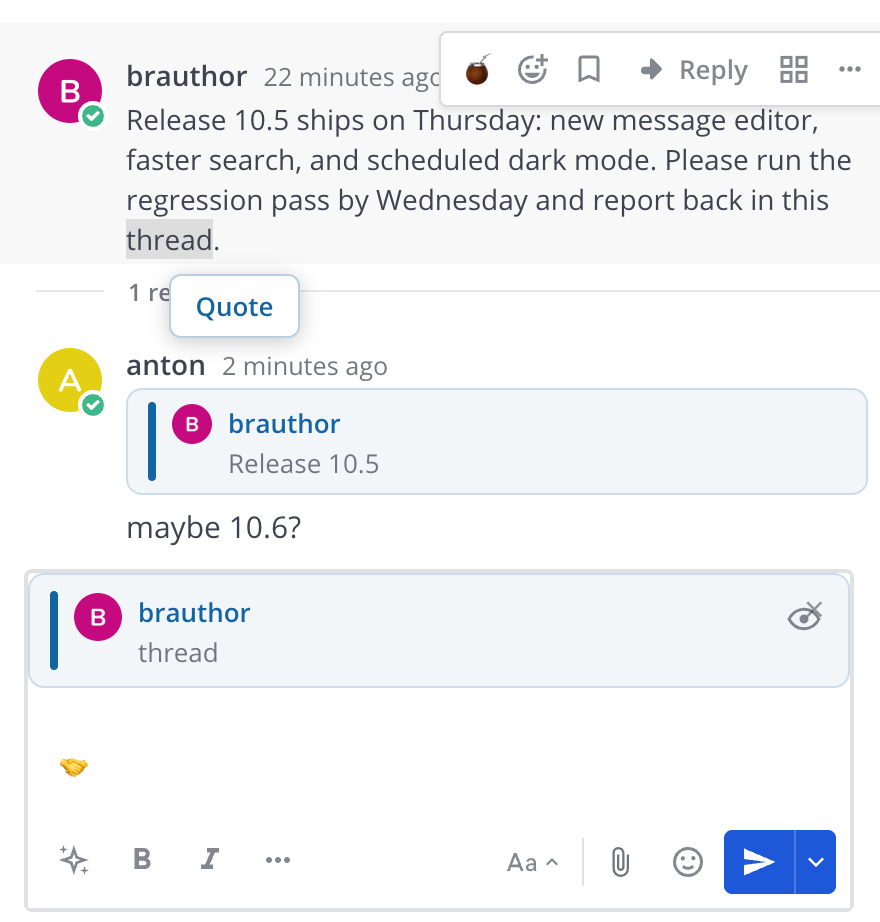

# Best Reply — Mattermost Plugin

<div align="center">

[](https://github.com/arxell/mattermost-plugin-best-reply/actions/workflows/ci.yml)
[](https://github.com/arxell/mattermost-plugin-best-reply/releases/latest)
[](https://github.com/arxell/mattermost-plugin-best-reply/actions/workflows/ci.yml)

**Reply to a message in the channel stream or in a thread — with a visible quote block. Select a fragment to quote only that part.**

</div>

Best Reply merges two plugins into one:

- the reply UX of [Azario16/mattermost-plugin-channel-reply](https://github.com/Azario16/mattermost-plugin-channel-reply) (MIT) — Reply button, composer preview, clickable quote blocks, channel/thread contexts;
- the fragment quoting of [ZILosoft/mattermost-reply](https://github.com/ZILosoft/mattermost-reply) (Apache-2.0) — select part of a message and quote just that fragment, with a Ctrl+Q hotkey.

## Features


*Reply in channel with a full-message quote.*



*Select a fragment — the **Quote** popup appears, and the reply quotes only the selected part (composer preview on top).*

- **Reply in channel** — answer a message right in the channel stream; the reply is posted as a separate channel message with a quote block on top (the thread sidebar does not open).
- **Reply in thread** — answer from the thread sidebar (or via **Thread** in the post menu); the reply stays in the thread.
- **Quote a fragment** — select part of a message and a small **Quote** popup appears above the selection (or press **Ctrl+Q**); the reply quotes only the selected text instead of the whole message.
- **Clickable quotes** — clicking a quote block jumps to the original message (permalink scroll + highlight), including inside an already open thread.
- **Quote preview** — a compact bar with the author, avatar and up to 5 quoted lines appears above the composer before you send; close it with × to cancel the reply.
- **Localized UI** — Reply/Quote labels follow the user's Mattermost language (English / русский / français / Deutsch).
- **Mobile fallback** — on clients without the plugin the reply is readable as a plain markdown quote (`> **Author** > quoted text`), including the fragment for selection-based replies.

Fragments are capped at 500 characters (truncated with an ellipsis). Whole-message quotes are not capped.

## Requirements

- Mattermost **9.0+** (tested with 10.5.x and **11.11.0**)
- **Collapsed Threads (CRT)** enabled (`always_on` recommended)
- Web or desktop client; creating quoted replies from the mobile app is not
  supported (reading works everywhere)

## Installation

### System Console

1. Download the latest `com.bestreply.plugin-<version>.tar.gz` from the [releases page](https://github.com/arxell/mattermost-plugin-best-reply/releases).
2. Open **System Console → Plugins → Plugin Management** and set **Enable Plugins** and **Enable Uploads** to `true`.
3. Click **Upload**, select the downloaded bundle.
4. Enable **Best Reply**.

### mmctl

```bash
mmctl plugin upload com.bestreply.plugin-<version>.tar.gz
mmctl plugin enable com.bestreply.plugin
```

Hard-refresh the web client afterwards (**Ctrl+F5**).

## Development

Prerequisites: Node.js (version from `webapp/.nvmrc`, currently 24).

```bash
make check-style   # ESLint + TypeScript type check
make test          # vitest unit tests (53 tests)
make coverage      # vitest with v8 coverage report
make dist          # build the plugin bundle (dist/*.tar.gz)
make deploy        # upload + enable the bundle on $MM_SERVICESETTINGS_SITEURL
```

`webapp/src/manifest.ts` is generated from `plugin.json` and git tags —
`make apply` regenerates it and is already a dependency of every make
target above, so never edit the file by hand (and never commit it; it is
gitignored). Working inside `webapp/` directly (`npm run lint`,
`npm run check-types`, `npm test`, `npm run build`, …) requires running
`node scripts/sync-manifest.mjs` once after a fresh checkout.

The plugin is **webapp-only** (no server component, no settings, no
tokens). The undocumented Mattermost internals it relies on (DOM
attributes, internal Redux actions, `window.PostUtils`) are documented in
[docs/api.md](docs/api.md) — read it before hacking on the plugin. Working
agreements and the list of Mattermost gotchas that cost us bugs are in
[AGENTS.md](AGENTS.md).

## Release process

1. Make sure `plugin.json` `version` matches the release you are about to
   tag, and the CHANGELOG entry is in place.
2. `git tag vX.Y.Z && git push origin vX.Y.Z` — tags are created only on
   explicit request, never automatically.
3. CI builds the bundle and creates a GitHub release with the tarball
   attached. The bundle version comes from the git tag via
   `git describe` (`webapp/scripts/sync-manifest.mjs`).

## Limitations

- The plugin builds on Mattermost webapp internals (DOM attributes, Redux
  action types, `window.PostUtils`). Re-test after every Mattermost upgrade;
  the verified semantics live in [docs/api.md](docs/api.md).
- **Collapsed Threads (CRT) is required** — the reply-in-thread flow opens
  the RHS thread panel via internal Redux actions.
- The plugin renames the native "Reply" action to "Thread" by overriding the
  core i18n key `post_info.reply`. If another plugin overrides the same key,
  the last registration wins and one of the labels will be wrong.
- The pending reply is stored in memory: reloading the page or switching
  away before sending discards it.
- Fragment quoting works on regular message bodies; selecting text inside an
  already quoted reply block is not supported.
- Quote metadata is attached client-side; there is no server-side validation
  of the quoted-post reference.

## License

This plugin is a derivative work:

- Base reply UX: [Azario16/mattermost-plugin-channel-reply](https://github.com/Azario16/mattermost-plugin-channel-reply) — MIT
- Fragment selection and popup: [ZILosoft/mattermost-reply](https://github.com/ZILosoft/mattermost-reply) — Apache License 2.0

See [NOTICE](NOTICE) for details. Licensed under the MIT License — see [LICENSE](LICENSE).
