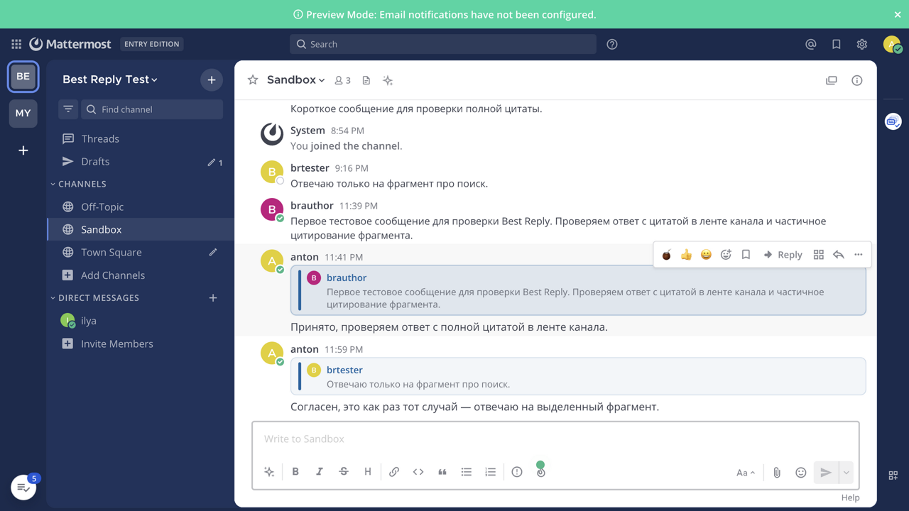

# Best Reply — Mattermost Plugin

<div align="center">

[](https://github.com/arxell/mattermost-plugin-best-reply/actions/workflows/ci.yml)
[](https://github.com/arxell/mattermost-plugin-best-reply/releases/latest)
[](https://github.com/arxell/mattermost-plugin-best-reply/actions/workflows/ci.yml)

**Reply to a message in the channel stream or in a thread — with a visible quote block. Select a fragment to quote only that part.**



</div>

Best Reply merges two plugins into one:

- the reply UX of [Azario16/mattermost-plugin-channel-reply](https://github.com/Azario16/mattermost-plugin-channel-reply) (MIT) — Reply button, composer preview, clickable quote blocks, channel/thread contexts;
- the fragment quoting of [ZILosoft/mattermost-reply](https://github.com/ZILosoft/mattermost-reply) (Apache-2.0) — select part of a message and quote just that fragment, with a Ctrl+Q hotkey.

## Key Features

- **Reply in channel** — answer a message right in the channel stream; the reply is posted as a separate channel message with a quote block on top (the thread sidebar does not open).
- **Reply in thread** — answer from the thread sidebar (or via **Thread** in the post menu); the reply stays in the thread.
- **Quote a fragment** — select part of a message and a small **Quote** popup appears above the selection (or press **Ctrl+Q**); the reply quotes only the selected text instead of the whole message.
- **Clickable quotes** — clicking a quote block jumps to the original message (permalink scroll + highlight), including inside an already open thread.
- **Quote preview** — a compact bar with the author, avatar and up to 5 quoted lines appears above the composer before you send; close it with × to cancel the reply.
- **Localized UI** — Reply/Quote labels follow the user's Mattermost language (English / русский).
- **Mobile fallback** — on clients without the plugin the reply is readable as a plain markdown quote (`> **Author** > quoted text`), including the fragment for selection-based replies.

Fragments are capped at 500 characters (truncated with an ellipsis). Whole-message quotes are not capped.

## How it works

The plugin is **webapp-only** (no server component, no settings, no tokens).
A pending reply is stored in the plugin's Redux slice and attached to the
next matching post by the `messageWillBePosted` hook:

| File | Responsibility |
|---|---|
| `webapp/src/index.tsx` | Plugin entry: registry calls and the message hook |
| `webapp/src/actions/reply.ts` | Starts a pending reply (channel/thread), focuses the composer |
| `webapp/src/actions/openThread.ts` | Opens the RHS thread via internal Redux actions |
| `webapp/src/actions/navigateToPost.ts` | Permalink navigation and quote highlighting |
| `webapp/src/components/ReplyButton.tsx` | Reply action on the post hover bar |
| `webapp/src/components/SelectionQuoteButton.tsx` | Selection popup + Ctrl+Q hotkey |
| `webapp/src/components/ReplyComposerPreview.tsx` | Quote bar above the composer |
| `webapp/src/components/QuotedReplyPost.tsx` | Rich rendering of quoted replies |
| `webapp/src/utils/selection.ts` | Selection → post id + fragment extraction |
| `webapp/src/utils/mobileQuote.ts` | Post transformation and mobile markdown fallback |

When the reply is sent, the post gets the custom type `custom_best_reply`
and props (`best_reply_to`, `best_reply_body`, `best_reply_text` for
fragments); the message body always carries the mobile-safe markdown quote.

The undocumented Mattermost internals this relies on (DOM attributes,
internal Redux actions, `window.PostUtils`) is documented in
[docs/api.md](docs/api.md) — read it before hacking on the plugin.

## Requirements

- Mattermost **9.0+** (tested with 10.5.x and **11.11.0**)
- **Collapsed Threads (CRT)** enabled (`always_on` recommended)
- Web or desktop client; creating quoted replies from the mobile app is not
  supported (reading works everywhere)

## Installation

### System Console

1. Open **System Console → Plugins → Plugin Management**
2. Set **Enable Plugins** and **Enable Uploads** to `true`
3. Click **Upload**, select `dist/com.bestreply.plugin-1.0.0.tar.gz`
4. Enable **Best Reply**

### mmctl

```bash
mmctl plugin upload dist/com.bestreply.plugin-1.0.0.tar.gz
mmctl plugin enable com.bestreply.plugin
```

Hard-refresh the web client afterwards (**Ctrl+F5**).

## Development

```bash
make check   # TypeScript type check
make test    # vitest unit tests (48 tests)
make dist    # build the plugin bundle
```

Working agreements and the list of Mattermost gotchas that cost us bugs are
in [AGENTS.md](AGENTS.md).

## Limitations

- The plugin builds on Mattermost webapp internals (DOM attributes, Redux
  action types, `window.PostUtils`). Re-test after every Mattermost upgrade;
  the verified semantics live in [docs/api.md](docs/api.md).
- The pending reply is stored in memory: reloading the page or switching
  away before sending discards it.
- Fragment quoting works on regular message bodies; selecting text inside an
  already quoted reply block is not supported.
- Quote metadata is attached client-side; there is no server-side validation
  of the quoted-post reference.

## Credits and licenses

This plugin is a derivative work:

- Base reply UX: [Azario16/mattermost-plugin-channel-reply](https://github.com/Azario16/mattermost-plugin-channel-reply) — MIT
- Fragment selection and popup: [ZILosoft/mattermost-reply](https://github.com/ZILosoft/mattermost-reply) — Apache License 2.0

See [NOTICE](NOTICE) for details. Licensed under the MIT License — see [LICENSE](LICENSE).
